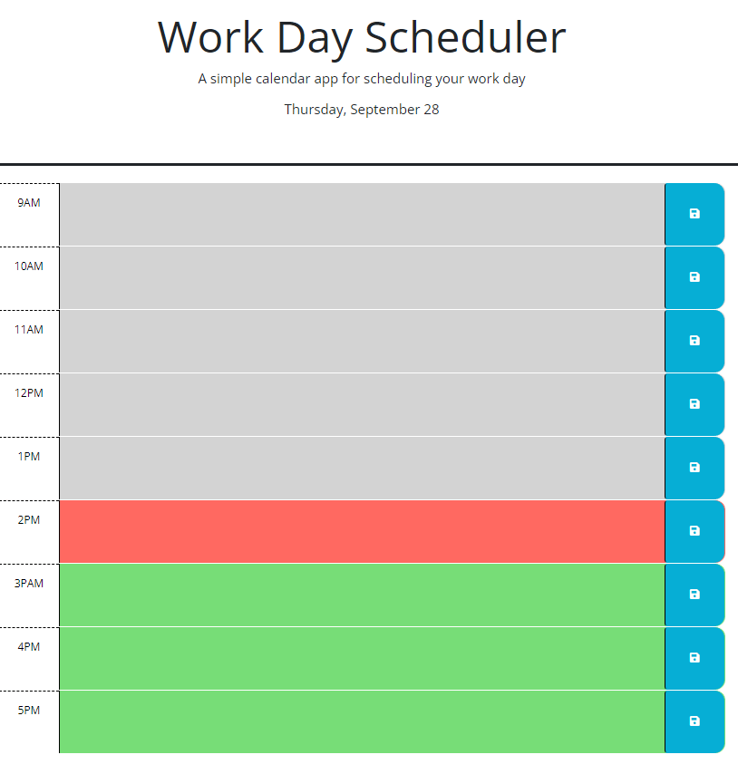

# 9-5 Scheduling Tool

## Description

A simple calendar application designed to assist in scheduling tasks over the course of the standard work day. Users can save events for each hour, and the application will indicate what hour block the user is currently in.

## Product

The deployed website can be found [here](https://ljpeach.github.io/9-5-Scheduling-Tool/).

## Project Preview

